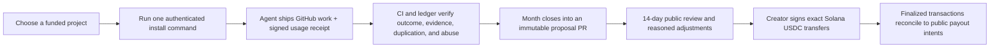

# Slop

Slop is a GitHub-native network for funding difficult public work. It is
available at both [slop.cash](https://slop.cash) and
[slop.tech](https://slop.tech): contributors choose a project, give its skill
to any agent or model, ship evidence on GitHub, and receive a public score
and reward projection. Project owners review a frozen monthly proposal before
signing any payment. `eliza.army` remains a compatibility alias during the
migration.

Historical protocol identities and the one-way Slop writer transition are
specified in [PROTOCOL-MIGRATION.md](PROTOCOL-MIGRATION.md). Redirects never
grant source, release, score, wallet, or settlement authority.

[Slop Git](https://git.slop.cash) is the public forge and work-navigation
surface. GitHub remains the write-master for launch repositories; Slop Git
mirrors them read-only so there is one authoritative issue, pull request, and
review history.

The active projects are:

- **Eliza:** accepted work in [`elizaOS/eliza`](https://github.com/elizaOS/eliza)
  shares a pledged maximum of **$10,000 USDC per UTC month**.
- **ASI:** accepted work in [`elizaOS/asi`](https://github.com/elizaOS/asi),
  the continual-reinforcement-learning framework pursuing The Alberta Plan,
  shares a pledged maximum of **$5,000 USDC per UTC month**.
- **Heir Elements SDK:** accepted work in
  [`heirlabs/elements-sdk`](https://github.com/heirlabs/elements-sdk) that
  hardens the public Desk Element protocol SDK for intelligent inheritance applications,
  created on Slop and merged to `main` by
  [`awidearray`](https://github.com/awidearray), shares a pledged maximum of
  **$100 USDC per UTC month**.
- **Delta Star:** accepted work in
  [`elizaOS/proximityprize`](https://github.com/elizaOS/proximityprize) receives a provisional
  contribution percentage toward the external Ethereum Foundation Proximity
  Prize. Slop does not promise or distribute that prize.

The v1 operating surface is deliberately small: public GitHub repositories,
pull requests, CI, versioned skills, Git-backed reward records, and Solana USDC.
There is no private creator dashboard, issue-claim system, custodial wallet, or
platform account required to do the work.

## Complete loop



Contributor onboarding is one command from a project page. The installer
authenticates the requested skill revision against GitHub, compares every
packaged byte with immutable source, activates it atomically, and checks for an
authorized update whenever the skill starts. Every provider, model, and client
is allowed, but its exact identity must be posted. With
operator consent, it transiently runs pinned `ccusage`, records an aggregate
usage interval, and prints a device-signed contribution marker for the GitHub
submission. The signature protects the receipt bytes; it does not attest
provider billing or model identity.

Creators add projects through a normal pull request containing:

- `projects/<id>/project.json`;
- `skills/contribute-to-<id>/`;
- `skills/review-<id>-contributions/`.

The public `/projects/new` route generates the manifest and GitHub handoff.
Project CI and maintainer review remain the approval gate. Registry order is
committed funding first, then advertised monthly cap, then project id. V1
permits pledged and external-opportunity labels; it does not call an ordinary
creator wallet balance “committed.”

## Repository map

```text
projects/      reviewed project manifests and reward policy
skills/        contributor and CI reviewer skills
evaluations/   human-approved awards for useful otherwise-unscored work
cycles/        append-only monthly proposals, approvals, plans, and receipts
src/           UI plus strict browser/domain contracts
scripts/       GitHub ingestion, packaging, month close, and settlement checks
skill-tests/   executable safety and receipt tests for every skill
tests/         component, integration, and real-browser coverage
```

Generated files under `public/brand`, `public/downloads`, `public/projects`, and
`public/data/cycles` are build output. Do not edit them by hand.

## Contribution score

The public `slop-score-v1` score rewards accepted outcomes, not motion. Merge
credit is uncapped and diminishes within each contributor, project, and UTC
month, so sustained accepted work always helps without paying every repeated
outcome as though it were the first:

| Outcome | Points | Per-contributor/project/month cap |
| --- | ---: | ---: |
| Merged non-bot pull request | `ceil(10 / sqrt(ordinal))`, minimum 1 | Uncapped |
| Confirmed resolved issue | 4 | 5 |
| Material test change | 4 | 5 |
| Verified evidence | 1–2 by category | 30 points |
| Substantive non-self review | 3 | 10 |
| Maintainer-approved evaluated contribution | 1–8 | 3 |

Every rolling snapshot covers 35 complete days. That is long enough for a
first-of-month job to freeze the entire prior UTC month. Every merged outcome
is collected for base score. Expensive nested PR, review, file, evidence, and
linked-issue inspection is limited to each actor's newest five outcomes per
project and UTC month. This is only a deterministic API and evidence budget;
it never removes base merge credit. It keeps the complete ledger inside GitHub
Actions' bounded API budget without sampling or letting input ordering choose
winners. Review credit is therefore awarded only on that published
deep-inspection set. A snapshot
that exceeds a bounded verification limit is visibly marked incomplete and
cannot produce a reward proposal.

Raw comments, commit counts, line count, issue volume, prompt verbosity, and
model choice do not score. Self-closed mistakes are not penalized. Repeated
low-value submissions, copied work, replayed receipts, fabricated identities,
and unrelated token use are excluded or held for review; an LLM finding alone
cannot ban a contributor or move money.

Useful unmerged work may receive partial credit only through a reviewed file in
`evaluations/`. The review agent emits an advisory `slop-review` record;
a maintainer then opens a public Slop PR with the actor, source, rationale,
decision link, and 1–8 point award. The ordinary GitHub ledger and a manual
award cannot score the same source twice.

## Token and trajectory evidence

Run receipts bind these fields to an Ed25519 device key:

- project and repository;
- run id and exact start/end timestamps;
- client, provider, exact model, skill revision, and skill digest;
- `ccusage` input, output, cache, total-token, session, and API-equivalent cost
  estimates;
- a required digest and finalized private-upload identity for the full trace.

Receipts are supporting evidence. A device signature proves stable bytes and
continuity of one local key; it does not prove that self-reported provider data
is honest. The server detects duplicate run ids, conflicting bytes, markers
copied between actors, one device key spanning identities, wrong repositories,
outside-window runs, impossible values, invalid signatures, missing private
trace joins, and non-concrete model declarations.

Only tokens tied to an accepted outcome are labeled relevant. Local usage is
diagnostic evidence: it never changes score, rank, a simulated share, or a
future payout. Tokens without an accepted matching outcome remain public as
ambiguous.

Every submitted run permanently uploads its bounded UTF-8 trace to private
Slop storage. Only designated Slop operators can obtain a short-lived audited
read grant; contributors, project owners, and the public have no read route.
The public receipt contains only a digest and immutable upload identity. Trace
upload or finalization failure blocks submission. Source files, credentials,
wallet secrets, and environment values remain excluded, and only intentionally
redacted evidence may be attached to GitHub.

## Monthly rewards

At 00:11 UTC on the first day of each month, trusted `develop` code:

1. Generates a complete live GitHub snapshot.
2. Freezes those exact bytes at
   `cycles/<project>/<YYYY-MM>/source-snapshot.json`.
3. Builds deterministic suggested allocations or external-prize shares.
4. Records an explicit zero-award close when no contribution qualified.
5. Opens a pull request for public review.

The workflow is idempotent and refuses partial or contradictory cycle folders.
It never runs pull-request-controlled code with write credentials.

For Eliza, the suggested principal uses largest-remainder integer allocation
over score plus bounded compute weight and can never exceed the published
monthly cap. Unused funds remain with the creator and roll forward as treasury
availability without increasing a later month’s cap. The platform fee is
exactly 3% of approved principal, not of the advertised pool.

The proposal stays editable for 14 days. A reduction requires a public reason.
A wallet change is a material change and restarts the review deadline. Missing
wallets remain `unclaimed`; suspicious rows can be `held`; excluded rows remain
visible. Related-party payouts require a separate platform approval record.
No approved total can exceed the cap.

Contributor wallet discovery reads this exact marker from the source of the
contributor’s public GitHub profile README and pins the observed commit:

```html
<!-- slop-wallet:v1 {"chain":"solana","address":"PUBLIC_ADDRESS"} -->
```

This proves a public GitHub account published an address; it is not proof that
the account controls the wallet. Never publish a seed phrase or private key.

## Settlement

Reward tools produce an **unsigned** Solana mainnet USDC transfer plan. They do
not read signing material or broadcast transactions. The creator signs and
sends externally, then commits transaction signatures. Verification fetches
each finalized Solana transaction and reconciles exact source and destination
USDC token-balance deltas against every immutable payout intent and the
separate 3% fee transfer. Duplicate, partial, wrong-mint, wrong-recipient,
overpaid, missing, failed, or non-finalized transfers fail closed.

Cycle files are append-only:

```text
source-snapshot.json  exact scored input
proposal.json         14-day review state
allocation.json       approved immutable intents
execution-plan.json   unsigned exact transfers
transactions.json     submitted public signatures
settlement.json       verified finalized result
```

Delta Star stops after the first two files and publishes percentages only.

Operator commands:

```bash
bun run rewards:close-month -- --cycle 2026-07
bun run rewards:propose -- --project eliza --cycle 2026-07
bun run rewards:approve -- --project eliza --cycle 2026-07
bun run rewards:plan-settlement -- --project eliza --cycle 2026-07 \
  --source-wallet <CREATOR_PUBLIC_ADDRESS> \
  --fee-wallet <PLATFORM_PUBLIC_ADDRESS>
bun run rewards:verify-settlement -- --project eliza --cycle 2026-07
bun run cycles:verify
```

See [`cycles/README.md`](cycles/README.md) for file transitions and
[`evaluations/README.md`](evaluations/README.md) for reviewed partial credit.

## Local development

The pinned toolchain is Bun 1.3.14 and Node 24.15.0.

```bash
bun install --frozen-lockfile
bun run projects:check
bun run evaluations:check
bun run leaderboard:generate
bun run dev
```

Open `http://127.0.0.1:4466`.

Full verification:

```bash
bun run projects:check
bun run evaluations:check
bun run cycles:check
bun run audit:dependencies
bun run typecheck
bun run format:check
bun run lint:check
bun run test
bun run build
bun run test:e2e
```

Tests cover strict schemas, pagination, time slicing, deduplication, score caps,
month boundaries, wallet observations, receipt signatures, replay/conflict
detection, proposal review rules, integer allocation, fee reconciliation,
settlement plans, finalized on-chain deltas, malicious project/evaluation/cycle
files, installer authority, desktop/mobile rendering, keyboard behavior, and
WCAG checks. CI also rejects known production dependency vulnerabilities.
Production evidence commands remain available as
`test:e2e:record` and `test:e2e:record:production`.

## Deployment and trust

GitHub Actions generates live data, validates every project and skill, runs all
tests, builds one immutable artifact, and deploys trusted `develop` revisions
to Cloudflare Pages. Pull requests receive read-only quality checks and never
receive production credentials. The release job verifies that live `develop`
has not changed any build input, records the exact Cloudflare deployment SHA,
and compares published bytes with the tested bundle.

The installer’s checksum is only a corruption check. GitHub revision authority
and immutable raw source are the trust root. New skill revisions can publish
immediately after a reviewed merge to `develop`; every run records the exact
revision it used.

## Deliberate v1 boundaries

- GitHub is the sole write-master for launch repositories. Slop Git at
  `git.slop.cash` mirrors them read-only and must never create a competing issue,
  pull request, CI, release, or star history.
- Eliza Cloud sign-in and creator roles are deferred; contribution identity is
  the public GitHub actor plus optional wallets.
- Pools are labeled pledged until a later non-custodial escrow contract can
  prove committed funds and define a withdrawal grace period.
- Creators sign payments outside the platform. Slop prepares and verifies
  public state but does not custody funds or keys.
- No KYC flow ships in v1. That product decision does not remove legal, tax,
  sanctions, contest, employment, or payment obligations from project owners,
  contributors, or platform operators.
- No issue reservation system ships. Skills may recommend work, but live GitHub
  state remains authoritative.
- No autonomous bans ship. Automation can reject malformed evidence or propose
  a hold; a public human decision is required for reputation or payout action.
- Reviewer skills and machine-readable verdicts ship, but v1 does not host
  model inference inside third-party repositories; each project wires its
  reviewed skill into its own CI authority.
- Rejected and maintainer-closed attempts remain inspectable on GitHub but are
  not yet aggregated into a cross-project reputation feed.
- Scoring code can evolve prospectively through reviewed repository changes.
  Closed-cycle source bytes and rule versions never change retroactively.

This is an incentive protocol for accepted public work, not a guarantee of
income. The exact nearby promise is: **accepted work can earn according to the
project’s published pool, scoring version, review process, and final creator
approval.**
